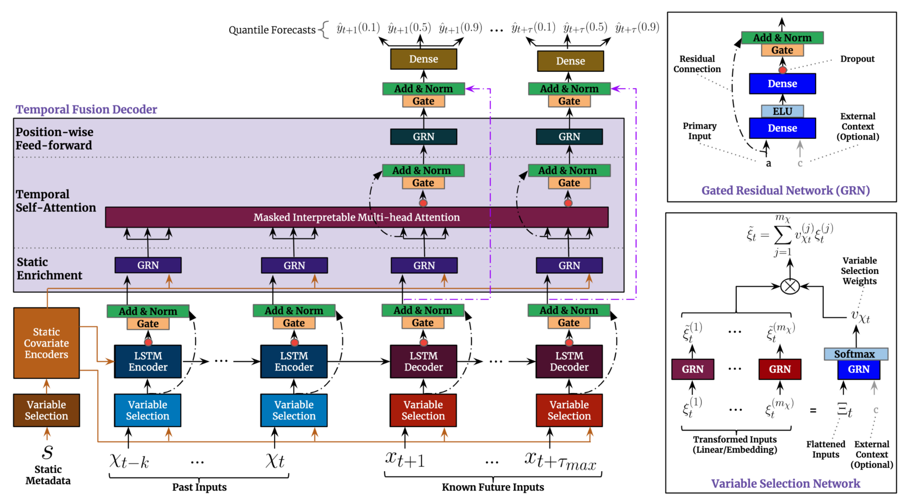

# Temporal Fusion Transformer (TFT) - Multivariate time-series CPI forecasting
---
*(Work in progress)*

This repository will focus on the **Temporal Fusion Transformer (TFT)** model and its application for multivariate, multi-frequency time-series forecasting of Consumer Price Index (CPI) in the US market, based on the a row of macroeconomic and pricing US data. The project is done for educational purposes and consists of the two major parts:
- Implementation of the original **[Lim et al. TFT paper](https://arxiv.org/pdf/1912.09363)** and all the submodules (**LSTM**, **GRN**, **GLU**, **Variable selection**, **Interpretable attention**) from scratch in **PyTorch**, without reference to any existing solution. File `model.py`;
- (WIP) Application of the model to the said CPI forecasting.

